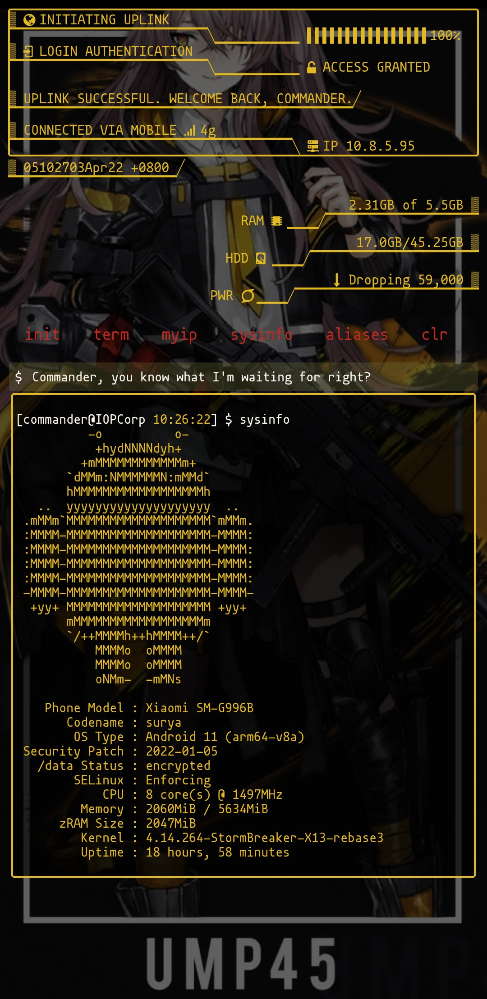

# sysinfo
Print system information

## Description
`sysinfo` grabs android device system information and prints it with an ascii
art logo on your screen.

## Features
**sysinfo will get details about your:**
* Phone brand, model, and codename
* Android version and cpu architecture
* Android security patch
* /data status: whether encrypted or decrypted
* SELinux status: whether enforcing or permissive
* CPU core count and scaling current frequency
* Memory: MemAvailable / MemTotal
* Total zRam size
* Kernel version
* Uptime: how long the system has been running
* An optional parameter to choose what logo to print
* And an optional parameter to print public IPv4 address

## Prerequisite
* Termux

_Install termux from Playstore or F-droid_
## Installation
**Open termux app and run the following commands:**
* `apt update && apt install -y git`
* `git clone https://github.com/deadrabbit404/sysinfo.git`
* `cd sysinfo && bash setup.sh`
* `restart` or `refresh` t-ui when setup is done

## How  to run
To execute the script, just type `sysinfo`. For more info, type `sysinfo -h` to print help message.

## Themes
Looking for cool themes like the one in the image above? Visit [M4dGun's t-ui themes](https://github.com/M4dGun/t-ui_themes)
repository. It's a  collection of the best themes for
T-UI and T-UI Expert Launcher made by the community.

